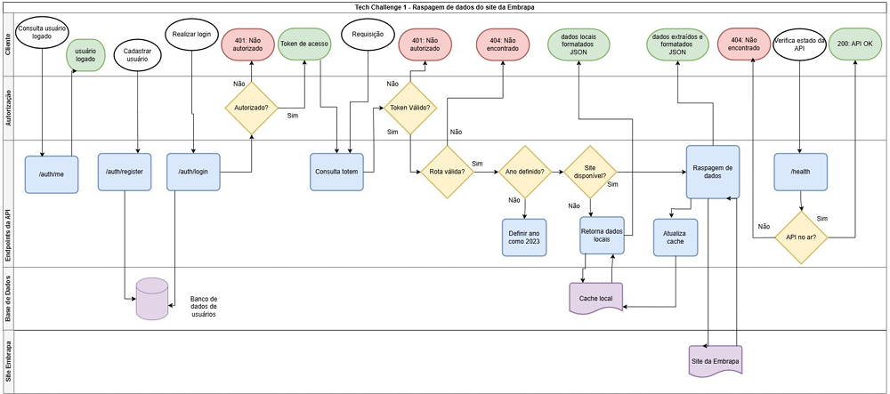
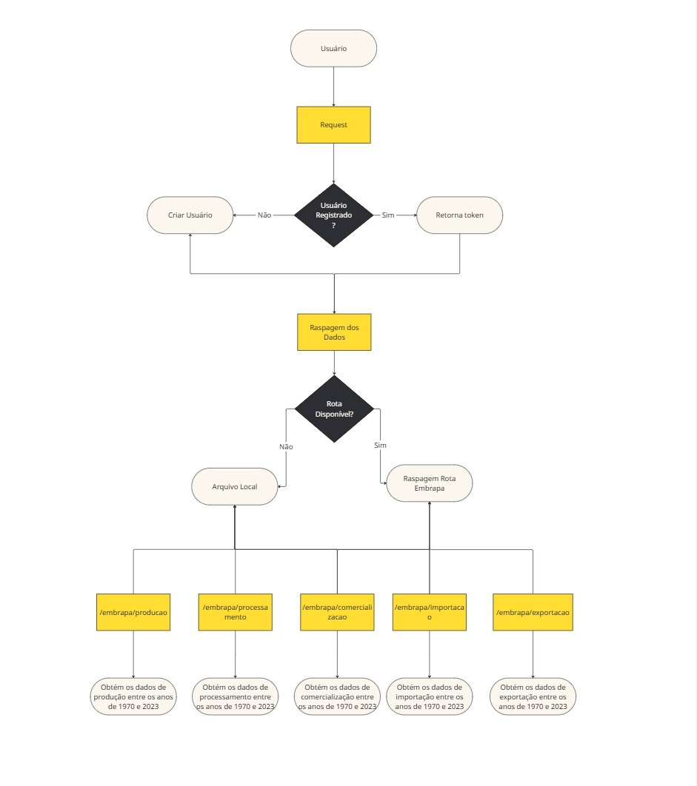

# 📊 Projeto FastAPI - Análise de Dados de Vitivinicultura da Embrapa

Este projeto fornece uma API REST construída com FastAPI e SQLAlchemy para acessar, processar e visualizar dados relacionados à vitivinicultura disponibilizados pela Embrapa.

---

## 🚀 Funcionalidades
- ✅ Autenticação Básica com JWT e OAuth2PasswordBearer (Swagger): protege rotas de acesso aos dados da Embrapa.
- ✅ Web Scraping: extrai dados das páginas de vitivinicultura da Embrapa usando BeautifulSoup.
- ✅ Cache e Documentação: implementa cache para otimização e documentação automática com Swagger.
- ✅ ORM SQLAlchemy: registro e login de usuários no banco de dados.
- ✅ Backup: armazena as páginas mais acessadas localmente para manter o funcionamento mesmo se a API da Embrapa ficar indisponível.

---

## 📁 Estrutura do Projeto
```
G:.
│   README.md
│   requirements.txt
│   SWAGGER.md
│
└───app
    │   main.py
    │
    ├───auth
    │   │   auth.py
    │   │   dependencies.py
    │   │   jwt.py
    │   │
    │   └───__pycache__
    │           dependencies.cpython-311.pyc
    │           auth.cpython-311.pyc
    │           jwt.cpython-311.pyc
    │
    ├───data
    │   │   app.db
    │   │   (Pastas com arquivos de backup)
    │
    ├───database
    │   │   init_db.py
    │   │   session.py
    │
    ├───helpers
    │   │   embrapa.py
    │
    ├───models
    │   │   user.py
    │   │   __init__.py
    │
    ├───routes
    │   │   embrapa.py
    │   │   health.py
    │   │
    │   ├───auth
    │   │   │   auth.py
    │
    ├───schemas
    │   │   auth.py
    │   │   embrapa.py
    │   │   health.py
    │
    ├───tests
    │   │   test_helper_embrapa.py
    │   │   test_route_embrapa.py
    │   │
    │   └───mock
    │           mocks.py
```

---

## 🛠️ Acesso ao Projeto
- 🌐 Acesse via web: `https://tech-challenge-fase1.onrender.com/`

- 💻 Localmente:
```bash
git clone https://github.com/ghpascon/tech_challenge_fase1.git
cd tech_challenge_fase1
python -m venv .venv
.venv\Scripts\activate
pip install -r requirements.txt
```
- Crie um arquivo `.env` com:
```
SECRET_KEY=fiap_tech_challenge
ALGORITHM=HS256
ACCESS_TOKEN_EXPIRE_MINUTES=30
DATABASE_URL=sqlite:///./app/data/app.db
```
- Rode o aplicativo:
```bash
uvicorn app.main:app --reload
```
- Acesse a documentação em `http://localhost:8000` (Swagger).

---

## Estrutura detalhada do projeto


## Fluxograma 


## 🔐 Autenticação no Swagger

### 1️⃣ Registro de Usuário
- Acesse `/auth/register`
- Preencha:
    - username
    - password
    - secret_key (use `fiap_tech_challenge`)


### 2️⃣ Autenticação
- Clique em **Authorize**


- Insira credenciais


- Teste na rota `/auth/me`


---

## 🍇 Consumo das APIs da Embrapa

### 🔗 Rotas de Chamada


- Filtro de ano (`ano` opcional)
✅ Válido de **1970 a 2023**
🔁 Se não informado ou inválido, usa **2023** por padrão.


---
